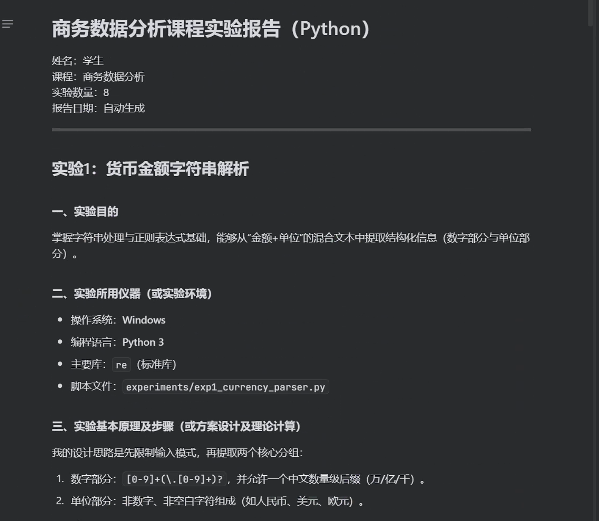
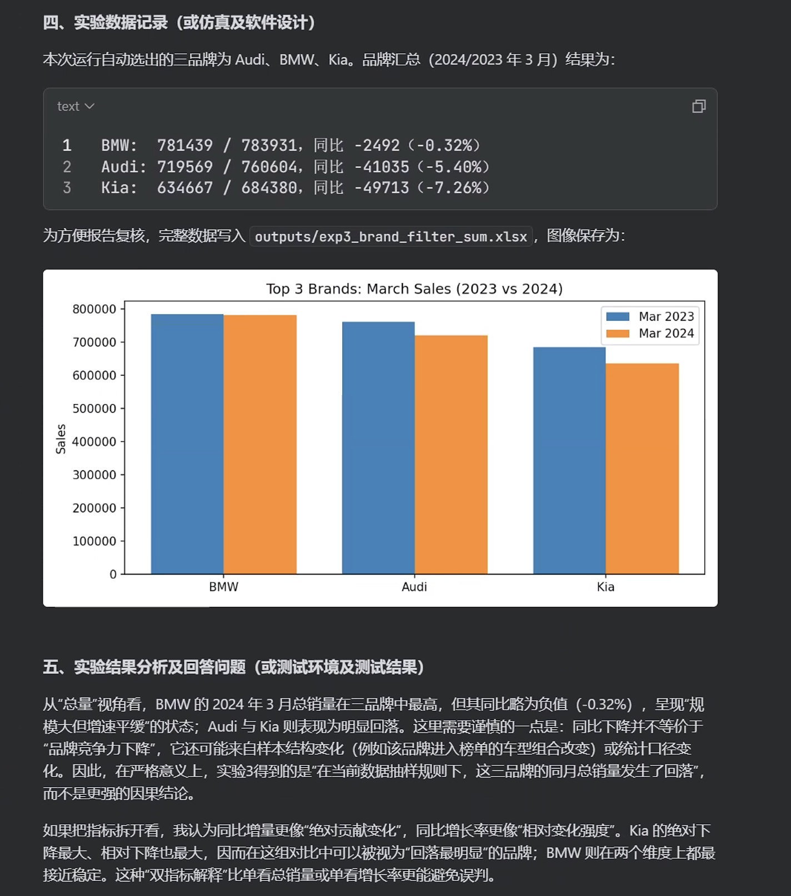

# 主要使用方式
我是用的是trae，使用solo模式。我感觉完成的效果还不错，遂将相关提示词和报告完成流程记录了下来，希望对其他同学有帮助。

**主要使用方式：需求 + 实验要求 + 报告模版**
**需求**：需求的话竟可能详细，比如说要求完成几个实验、先将实验报告撰写进md文件中（因为docx文件是二进制的，不能直接处理，借由md文件，最终将md转换成docx文件会非常便捷，期间不会应为docx文件的读取出现各种问题）、撰写需要包含运行的图片结果等等。
**实验要求**：将老师给的要求粘贴过来即可。
**报告模版**：将老师给的报告模版粘贴过来即可。


提示词实例：
```
我现在作为一个学生，需要完成商务数据分析课程的八个python数据分析实验。你需要编写python代码为每个实验创建python文件运行进行数据分析和挖掘，完成实验任务，帮忙撰写实验报告放入md文件中（包括图片，请保存到统一路径，能正常展示到md文件中）。
重点在实验报告，你需要按照报告的格式，根据python源代码和运行的结果详尽的完善报告内容。撰写报告的过程中要有自己的想法思考过程，然后再附上代码和结果，以及在每个实验中遇到的问题、解决方法、心得等等。

实验1:
练习课堂上讲的各种数据类型的基本操作函数 独自设计python程序，完成下述过程： 接收用户输入，输入带两种长度单位的货币金额（即考虑不同长度的单位情况），如企业年收入为300万人民币或20美元，运用课堂上的字符串处理函数，将数量与单位分开，如用户输入300万人民币或20美元，用程序分别提取出数字：300万和单位：人民币/20和单位：美元，并将数字部分和单位部分分别输出。

实验2:
练习课堂上讲的从excel文件读取数据，并对数据进行排序、筛选的python函数。 独自设计python程序，完成如下实验： 读取汽车销量数据（Top20Cars.xlsx​），并按照2024年的销售数据进行升序/降序排序，将排序后的列重命名,最终将排序结果写入新文件中​。最后，在实验报告中，对排序后的数据进行分析（不做进一步操作，只针对排序结果进行分析），能得到什么结论？ 

实验3:
练习课堂上讲的从excel文件读取数据，并对数据进行排序、筛选的python函数。 独自设计python程序，完成如下实验： 读取汽车销量数据（Top20Cars.xlsx​），筛选三种不同品牌车辆的销售情况，并分别计算筛选出来的这三种不同品牌车辆2024年3月和2023年3月的销售总额，并将筛选和计算结果写入新文件​。 

实验4:
练习课堂上讲的从excel文件读取数据，并对数据进行排序、筛选的python函数。 独自设计python程序，完成如下实验： 读取汽车销量数据（Top20Cars.xlsx​），筛选出销售上升的车辆款式，并将筛选结果按照倒序排序，将筛选结果写入新文件中。最后，在实验报告中，对排序后的数据进行分析（不做进一步操作，只针对排序结果进行分析），能得到什么结论？


实验5:
练习课堂上讲的从excel文件读取数据，并对数据进行统计计数的python函数。 独自设计python程序，完成如下实验： 读取软饮料销售记录（SoftDrinks.xlsx​），统计各个品牌软饮料销售数量，将销售数据倒序排序，并将统计结果写入新文件中，并对统计结果进行分析，能够得到哪些结论？ 读取上述已经排好序的文件数据，对销售数据进行进一步分析，自己确定合适的分析维度，然后将分析的不同维度的数据写入到另一个新文件中​。 

实验6:
练习课堂上讲的从excel文件读取数据，并对数据进行统计计数的python函数。 独自设计python程序，完成如下实验： 读取财务审计天数的文件数据（AuditData.xlsx​），选择合适的分析视角对数据进行分析，并给出分析依据（为什么对这组数据从这些角度对他进行分析）同时在实验报告中对分析结果进行讨论。

实验7:

读取AccountsManaged.xlsx​数据，对数据进行排序并进行合理的可视化展示，需要在可视化结果中合理的展示每个条形在横坐标的标签。并对可视化结果进行分析。 读取AccountsManaged.xlsx数据，绘制每个经理处理账目的饼图，并将最终结果进行保存。


实验8:
读取Restaurant.xlsx​数据，以餐厅质量/等待时间/菜品价格为行，至少做三个不同的数据透视表，并对透视的结果进行解释分析 。

实验报告模版：
实验报告内容基本要求及参考格式
一、实验目的
二、实验所用仪器（或实验环境）
三、实验基本原理及步骤（或方案设计及理论计算）
四、实验数据记录（或仿真及软件设计）
五、实验结果分析及回答问题（或测试环境及测试结果）
```

下图便是第一次生成，虽然已经有图片和文本内容了，但实际上还是有很多问题，不能直接提交给老师。


# 后续优化
接下来使用二段提示词，修改文本内容，优化细节。
请把更详细的内容再次声明出来，需要有代码片（附上讲解），需要对运行结果进一步挖掘等等。
提示词二段：
```
`f:\实验报告.md` 对于实验报告的内容，点标识和符号标识感觉有些多，能否再次生成一版结果。其中文字组织形式主要参考论文形式，不要是一眼ai的点标识。同时多粘贴代码片，对代码进行讲解。多一些理性的挖掘和思考。请一部分一部分完成上述任务。
```
如果实验有很多，比如说这一次一共有八个小实验要求完成，可以将其分为四组，分四次完成。
分布提示词：
```
请以同样的方式改写实验3和实验4，同时不要忘记图片的插入。
```
再看咱们生成的结果，就已经很像模像样了。

同时运行图片也是有的，也有配上的结果解释：


再最后，我们可以让AI再进行一次复查，查明结果与vibecoding结果是否有差异：
```
实验1: 
 练习课堂上讲的各种数据类型的基本操作函数独自设计python程序，完成下述过程： 接收用户输入，输入带两种长度单位的货币金额（即考虑不同长度的单位情况），如企业年收入为300万人民币或20美元，运用课堂上的字符串处理函数，将数量与单位分开，如用户输入300万人民币或20美元，用程序分别提取出数字：300万和单位：人民币/20和单位：美元，并将数字部分和单位部分分别输出。 
 
 实验2: 
 练习课堂上讲的从excel文件读取数据，并对数据进行排序、筛选的python函数。 独自设计python程序，完成如下实验： 读取汽车销量数据（Top20Cars.xlsx​），并按照2024年的销售数据进行升序/降序排序，将排序后的列重命名,最终将排序结果写入新文件中​。最后，在实验报告中，对排序后的数据进行分析（不做进一步操作，只针对排序结果进行分析），能得到什么结论？ 
 
 实验3: 
 练习课堂上讲的从excel文件读取数据，并对数据进行排序、筛选的python函数。 独自设计python程序，完成如下实验： 读取汽车销量数据（Top20Cars.xlsx​），筛选三种不同品牌车辆的销售情况，并分别计算筛选出来的这三种不同品牌车辆2024年3月和2023年3月的销售总额，并将筛选和计算结果写入新文件​。 
 
 实验4: 
 练习课堂上讲的从excel文件读取数据，并对数据进行排序、筛选的python函数。 独自设计python程序，完成如下实验： 读取汽车销量数据（Top20Cars.xlsx​），筛选出销售上升的车辆款式，并将筛选结果按照倒序排序，将筛选结果写入新文件中。最后，在实验报告中，对排序后的数据进行分析（不做进一步操作，只针对排序结果进行分析），能得到什么结论？ 
 
 
 实验5: 
 练习课堂上讲的从excel文件读取数据，并对数据进行统计计数的python函数。 独自设计python程序，完成如下实验： 读取软饮料销售记录（SoftDrinks.xlsx​），统计各个品牌软饮料销售数量，将销售数据倒序排序，并将统计结果写入新文件中，并对统计结果进行分析，能够得到哪些结论？ 读取上述已经排好序的文件数据，对销售数据进行进一步分析，自己确定合适的分析维度，然后将分析的不同维度的数据写入到另一个新文件中​。 
 
 实验6: 
 练习课堂上讲的从excel文件读取数据，并对数据进行统计计数的python函数。 独自设计python程序，完成如下实验： 读取财务审计天数的文件数据（AuditData.xlsx​），选择合适的分析视角对数据进行分析，并给出分析依据（为什么对这组数据从这些角度对他进行分析）同时在实验报告中对分析结果进行讨论。 
 
 实验7: 
 
 读取AccountsManaged.xlsx​数据，对数据进行排序并进行合理的可视化展示，需要在可视化结果中合理的展示每个条形在横坐标的标签。并对可视化结果进行分析。 读取AccountsManaged.xlsx数据，绘制每个经理处理账目的饼图，并将最终结果进行保存。 
 
 
 实验8: 
 读取Restaurant.xlsx​数据，以餐厅质量/等待时间/菜品价格为行，至少做三个不同的数据透视表，并对透视的结果进行解释分析 。 
 
 再仔细检查一遍实验要求，将最新版报告缺少的点补充完善。
```
同时，我们也可以查看报告中的问题，对于自己发现但是AI没发现的，重点提出来，让它去帮忙修改。

# 导出word文件
最终，我们让AI编写脚本，调用python库将md文件转换为docx文件，即可向docx模版中轻松迁移。这样，一份接近完整版的报告初版就生成完成了。

提示词：
```
请使用python库工具将 实验报告_v2.md 导出为word文件。
```

现在与AI交互给我的感觉是，不需要追求一次性就要将所有内容完成的尽善尽美，可以再过程中逐步完善自己想要的，AI也能完成的很好。不过心里要有一个底，不能完全不知道AI在干什么，用的什么技术和框架。否则使用 vibe coding 时就会非常难受。